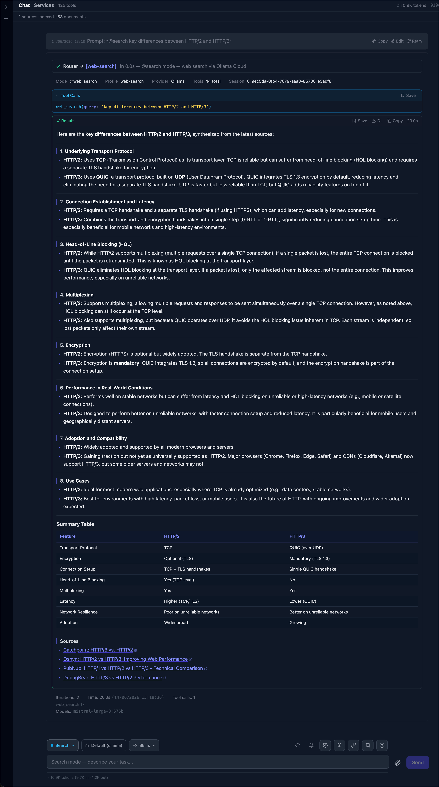
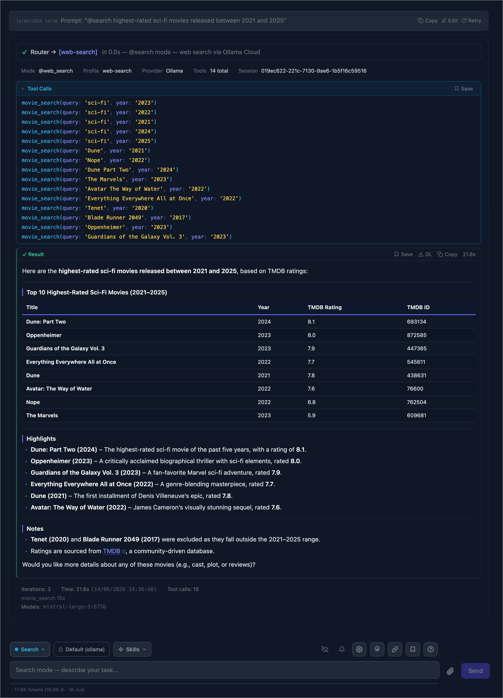

# AgentForge WebUI

[](https://github.com/bulletinmybeard/agent-forge-web-ui/actions/workflows/ci.yml)
[](./LICENSE)
[](https://vitejs.dev/)
[](https://biomejs.dev/)
[](https://github.com/bulletinmybeard/agent-forge/releases/tag/v0.6.0)

> [!NOTE]
> **Experimental!**
> AgentForge WebUI is the front-end I tinker with to see how AgentForge feels as a full chat app: every mode, the tools, connectors, and the live think-act-observe stream in one place. It is early, lightly tested, and rough in the corners I haven't needed yet.

AgentForge WebUI is a React SPA for [AgentForge](https://github.com/bulletinmybeard/agent-forge).

It's a pure frontend: it streams the agent's think > act > observe loop over the backend's `/ws/chat` WebSocket and calls its REST API for sessions, uploads, memory, and configs. It does nothing on its own why a running AgentForge backend is required!

## Features

- Streaming chat over the `/ws/chat` WebSocket, with the full think > act > observe event stream rendered live
- Mode picker for the `@mode` prefixes (chat, docs, search, agent, sql, logs, discover, pipeline, review, research, coding, scheduler, monitor, connectors, and custom agents), each with its own colour
- Per-event message cards: routing, config, tool calls, confirm + secret dialogs, results, summaries, errors, search metadata, discovery, research, scheduler/monitor jobs, file diffs, agent warning/recovery/retry/escalation, model fallback, and session compaction
- Connectors UI: connect and manage multi-account Google (Gmail, Drive, BigQuery, YouTube), GitLab, and GitHub connections, with per-connection product/permission display and an in-place read/write toggle
- Canvas workspace for pinned snippets, results, and queries
- Bookmarks: save tool-call sets and agent answers from any run, fuzzy-searchable in a modal
- Botty side panel for passive, in-context suggestions and full semantic-searchable chat session history
- Session sidebar, status bar, knowledge bar, memory settings, profile and provider selectors, and a help modal
- Context-usage bar with one-click session compaction at the critical threshold
- Eager file uploads: paperclip, clipboard paste, or drag-and-drop with inline thumbnails. Unset attachments persist across reloads
- GitHub-flavoured Markdown rendering and a Monaco-based inline prompt editor

## Getting started

Prerequisites: Node 20+ and a running AgentForge backend **0.6.0 or newer** (see the [backend repo](https://github.com/bulletinmybeard/agent-forge), as its `scripts/deploy-local.sh` brings the stack up with the web service on `:8200`).

```bash
npm install
npm run dev  # Vite dev server on http://localhost:5173
```

The dev server proxies `/ws`, `/api`, and `/uploads` to the backend. The target defaults to `http://localhost:8200`; override it with `VITE_BACKEND_URL`:

```bash
VITE_BACKEND_URL=https://agent.remote npm run dev
```

## Build

```bash
npm run build    # production build to dist/
npm run preview  # serve the build locally
```

## Run with Docker

`scripts/deploy-web-local.sh` builds the SPA and runs it on this host as a standalone nginx container (`Dockerfile` + `docker-compose.web.local.yml`). It serves the static bundle and reverse-proxies `/ws`, `/api`, and `/uploads` to your AgentForge backend — nothing leaves the machine.

```bash
scripts/deploy-web-local.sh    # build + run, detached, on http://localhost:8400
scripts/teardown-web-local.sh  # stop and remove it
```

It expects an AgentForge backend reachable at `http://host.docker.internal:8200` (the default from the backend's `scripts/deploy-local.sh`).

Flags:

- `--dev` (alias `--hot`): skip the container and run the Vite dev server with hot reload on the same port, proxying `/ws` `/api` `/uploads` to the backend. The fast inner loop: no image, no rebuilds, instant reloads on save
- `--no-build`: recreate the container without rebuilding the image
- `--no-cache`: force a clean image build (no Docker layer cache)
- `--foreground`: run attached and stream logs instead of detaching

Defaults come from `deploy-web.local.env` (optional: copy `deploy-web.local.env.example`): `WEB_PORT` (default `8400`) and `AGENT_BACKEND` (default `http://host.docker.internal:8200`).

## Screenshots

<table>
  <tr valign="top">
    <td width="50%">
      <a href=".github/assets/agent-forge-web-ui-prompt-demo-1.png">
        
      </a>
    </td>
    <td width="50%">
      <a href=".github/assets/agent-forge-web-ui-prompt-demo-2.png">
        
      </a>
    </td>
  </tr>
  <tr>
    <td align="center"><em>Web search: routing, a tool call, and a sourced answer with a summary table</em></td>
    <td align="center"><em>A date-range run: ranked, sourced results plus a note on what it excluded as out of range</em></td>
  </tr>
</table>

More demo screenshots: [mode picker](.github/assets/agent-forge-web-ui-chat-mode-selector-popover.png) · [provider selector](.github/assets/agent-forge-web-ui-chat-llm-provider-selector-popover.png) · [skills](.github/assets/agent-forge-web-ui-chat-skills-popover.png) · [connectors](.github/assets/agent-forge-web-ui-connectors-modal.png) · [bookmarks](.github/assets/agent-forge-web-ui-bookmarks-modal.png) · [memory](.github/assets/agent-forge-web-ui-memory-modal.png) · [profile overrides](.github/assets/agent-forge-web-ui-model-profile-overrides-modal.png) · [attachments](.github/assets/agent-forge-web-ui-attachments.png) · [private session](.github/assets/agent-forge-web-ui-private-session.png) · [help](.github/assets/agent-forge-web-ui-agent-forge-help-modal.png)

## License

MIT, see [LICENSE](LICENSE).
